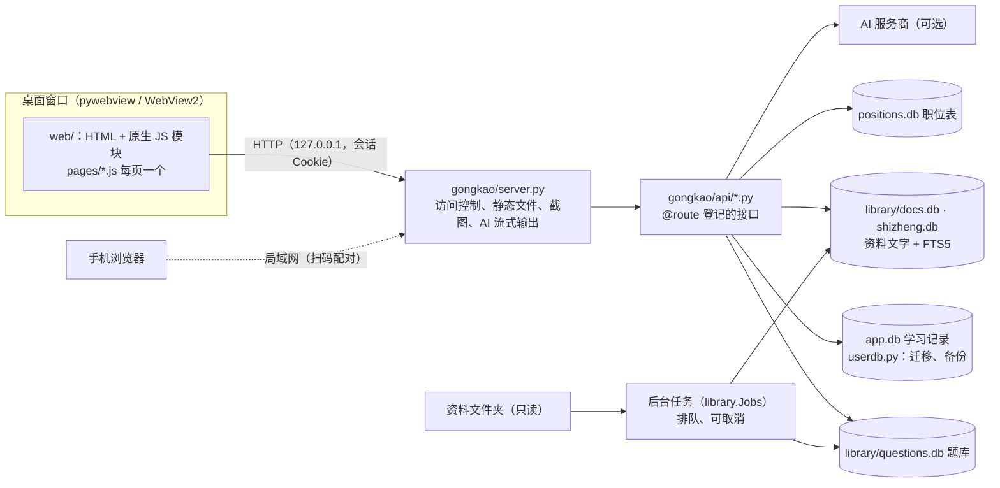

# 上岸备考

一个在自己电脑上运行的公务员考试（国考 + 省考）备考桌面软件，从零基础入门一直覆盖到面试。
界面和启动方式与 EngNest 一致：桌面窗口（pywebview），默认主题是 EngNest 的「珍藏手稿」——象牙纸、油画撕边、洛可可卷草、酒红批注，深色模式为「画廊之夜」。

## 启动

```bash
python main.py            # 正常启动（桌面窗口）
python main.py --debug    # 开启开发者工具（右键 → 检查），日志也打到控制台
python main.py --browser  # 不开窗口，用系统浏览器打开
python main.py --serve    # 只启动数据服务（开发调试界面用，可以和正在用的窗口同时开）
```

也可以双击 `start.bat`（使用 conda 环境 `gongkao-prep` 从源码启动）。

首次准备环境：

```bash
conda create -n gongkao-prep python=3.11 -y
conda run -n gongkao-prep pip install -r requirements.txt -r requirements-dev.txt
```

`requirements.txt` 是运行需要的库（锁定了测试过的版本），`requirements-dev.txt` 是打包、测试、检查用的。

## 打包

双击 `build.bat`：先跑代码检查和测试，再打包成目录版 `dist\GongkaoPrep\`（双击里面的 `GongkaoPrep.exe`）。
目录版不用每次启动都解压，打开快，也不容易被杀毒软件误报。装了 [Inno Setup 6](https://jrsoftware.org/isinfo.php) 时还会生成安装包
`installer\Output\GongkaoPrep-版本-setup.exe`（装到用户目录，不需要管理员权限）；没装就打成 `dist\GongkaoPrep-版本.zip`。
打包配置在 `GongkaoPrep.spec`，版本号在 `gongkao/__init__.py`，exe 带版本信息；「设置 → 关于与诊断 → 检查更新」读本仓库的 GitHub Release。
推送 `v` 开头的标签时，GitHub Actions 也会自动打包。

## 数据位置

学习记录、整理好的资料库、缓存都在一个数据文件夹里，默认是 `%APPDATA%\GongkaoPrep\`。
在「设置 → 数据位置与空间」可以换到别的盘（比如 `E:\AppData\GongkaoPrep`）：登记后关掉软件再打开，启动时先把数据搬过去，
C 盘只留一个记录位置的 `location.json`。同一页能看到各部分占的空间，清理可以重新生成的缓存，压缩数据库。

- 学习记录 `app.db`：每天第一次打开时自动备份到 `backups\`（保留 7 天），导入、恢复之前也会留快照；表结构升级时自动迁移；
- 整理好的资料 `library\`：真题题库、资料库文档、时政晨读、全文索引、文字识别缓存（约 1.4 GB，主要是资料文字和插图）；
- 日志 `logs\app.log`：出问题时在「设置 → 关于与诊断」导出诊断信息；
- 面试录音 `recordings\`、职位表 `positions.db`。

同一个数据文件夹同时只能开一个窗口，重复打开会把已经打开的窗口调到前面。

## 功能

| 模块 | 内容 |
|---|---|
| 首页 | 国考 / 省考倒计时、今日任务、打卡、连续打卡天数、近 7 天学习时长、各模块正确率；“今日复习”列出到期的错题、闪卡和还能学的新卡 |
| 复习计划 | 按考试日期自动分阶段（基础入门 → 专项突破 → 模考冲刺 → 省考查漏补缺 → 强化 → 冲刺 → 面试），每天自动生成任务，打卡日历，关键时间节点 |
| 系统教程 | 10 门课、140 节互动课：入门与规划、政治理论、常识、言语、数量、判断、资料分析、申论、面试、考场策略。课里有随堂测验、分步例题、填空排序连线、速算小练、资料分析计算器、真题演练、申论动笔写（对照要点自评 / AI 批改）、面试计时开口练；记录进度和正确率，学完的课里的记忆卡自动进“教程知识卡”卡组，可全文搜索 |
| 资料库 | 讲义、笔记、常识、申论素材整理成带目录的文字（扫描件 OCR 识别），按行测五个模块 / 申论（素材、范文、方法）/ 省情 / 面试分类，点卡片直接打开。讲义里的例题可以直接点选项作答，自动判对错、显示答案和解析（答案来自资料本身、讲义答案框、题库原题，纯计算题由软件按算式算出），填空横线可以输入并核对；竖排分数按原样显示。阅读时：目录跟随阅读位置、全部资料全文搜索、本资料内查找、四色高亮（再点同色或“取消高亮”可撤销）和批注、摘到积累、一键记到笔记本、选中一段问 AI、记住读到哪里、收藏 / 在读 / 已读完。真题、题册、答案解析不放在资料库，题目在「真题卷」「刷题」里做 |
| 时政晨读 | 资料文件夹里的“时政合集 + 每日晨读”整理成文字：**月度时政**（超格讲练 / 热点汇总 / 月度刷题、小黑月半时政、粉笔串讲，按年 → 月 → 上下半月排，可按机构筛）、**时政专题**（两会与政府工作报告、一号文件、全会与“十五五”、经济会议、新年贺词、法律、党建等）、**时政题库**（时政 300 / 600 / 1900 题等，可直接作答）、**人民日报精读**（每天一篇：原文、思维导图还原成的提纲、拆解报告和仿写范文）、**成语积累**（每天的人民日报原句 + 成语释义，可挖空自测、标记已学、收进积累，另有去重后的成语总表和“人民日报成语积累”闪卡卡组）；随机刷时政题（按最近 3 个月 / 半年 / 一年 / 全部抽题，做完看错题和出处）；全部内容全文搜索 |
| 真题卷 | 从资料文件夹自动识别的国考（2000–2026）、四川省考（2007–2026）行测真题，含答案和解析；整卷限时模考或按模块练，图形推理、图表题显示原卷截图；千题册按题型顺序练、随机练或限时练 |
| 专项刷题 | 按模块 / 题型出题，可选内置练习题、国考真题、四川真题、近几年真题；优先新题、随机、只做错题、只做收藏；练习模式即时解析，限时模式模拟考场。做到一半关掉软件也没关系，下次打开会提示继续。题目有错（OCR 错字、答案不对）可以点“纠错”自己改，重新整理资料也会保留 |
| 模拟考试 | 按国考地市级 / 副省级的模块比例组卷，严格计时，交卷后出各模块正确率、用时和估分（按常见估分口径折算成百分制），估分走势和目标分对比 |
| 错题本 | 做错自动收录，第二天复习，之后按 FSRS 记忆模型拉长间隔（约 2、5、15、35 天……），超过 30 天算掌握；错因标注与统计；收藏夹；导出打印版（可另存为 PDF，答案可以放最后） |
| 笔记本 | 自己容易忘的公式、知识点分本子记（默认公式本 / 知识点本，可新建、改名）。资料库里选中文字，工具条上直接点笔记本名字就收进来（新建的笔记本自动出现在工具条上），公式照原样显示，能点回原文；也可以自己写，公式用 `$…$`。搜索、置顶、“遮住自测”只露标题；每个本子自动成为一个闪卡卡组 |
| 速算训练 | 口算基本功：《新速算》练习册 660 期约 11.8 万题（两位×一位、两位/三位数加减、除法商首位/前两位、四位数除法四选一），按期顺序往下练、显示题量和进度；资料分析公式：两位数乘法、除法估算、基期、增长量、增长率、隔年增长率、平均数增长率、比重、百分数乘法、三位数乘法估算、百化分，随机出题不限量。题库由 `tools/build_speed.py` 从资料目录的“速算”文件夹生成 `content/speed_bank.json` |
| 申论练习 | 83 套原创材料 + 资料库里的国考、四川历年申论真题（材料、题目、参考答案）；方格纸作答、字数统计、计时、对照要点或参考答案自评、历史作答；AI 按固定评分细则（要点 70%、结构 15%、语言 15%）批改，分数存档，画得分率走势 |
| 面试练习 | 28 道结构化面试题，思考 1 分钟 + 作答 3 分钟计时，各题型答题框架和参考思路；作答时录音，回听并统计停顿、有声比例；装了 faster-whisper 可以本机转文字、算语速、数口头禅；AI 点评、AI 考官追问两轮 |
| 素材积累 | 素材库约 1.1 万条：从资料里的申论素材拆出的规范表述、金句、名言古句、人物事例、典故、论据、开头结尾、热点素材、范文，加上 18 个主题的内置精选和 2025、2026 年政府工作报告提法；按类型 / 主题 / 来源筛选、搜索、随机抽背、收进积累、点来源回到原文；我的积累、每日阅读记录 |
| 闪卡记忆 | 内置 7 个卡组 + 从资料库背诵材料生成的卡组（常识 4600 问、高频成语、实词辨析、词语辨析等）+ 我的积累 + 每个笔记本；FSRS 记忆模型调度，翻面后按“重来 / 困难 / 良好 / 简单”打分，按钮上显示下次间隔；每天新卡、复习上限可设 |
| 学习统计 | 近 30 天趋势、各模块正确率与平均用时、学习时间分布、半年热力图；按考点找弱项（如“隔年增长率”“削弱型论证”），一键去学对应的课、练这个考点的题；按题型分析用时（超时、慢而对、快而错），按“每分钟得分”建议作答顺序 |
| 专注计时 | 侧栏番茄钟，结束自动记入对应科目的学习时长 |
| AI 助教（可选） | 讲题、申论批改估分、面试点评和追问、资料问答、自由提问；记录每月用量，可设上限、按自己填的单价估算费用 |
| 选岗 | 导入国考 / 省考《职位表》Excel，填好学历、政治面貌、基层年限、服务基层项目、专业，逐个岗位判断能不能报并写明原因；导入报名人数后按报录比排序；收藏岗位 |
| 手机访问 | 同一个 Wi-Fi 下用手机扫码配对后，在手机上背闪卡、读时政、刷题，记录都存在电脑上；默认关闭，改数据位置、恢复备份等管理功能只能在电脑上做 |

## 资料库与真题

在「设置 → 资料文件夹」填写存放资料的文件夹（默认 `E:\aaaaaaaa\gongkao`），第一次打开软件会在后台自动整理，约 5 分钟：

1. **扫描目录**：记录每个文件的页数、是否扫描件，按真题 / 题册 / 笔记讲义 / 申论素材 / 常识积累分类；
2. **生成真题题库**：找出国考、四川的行测真题卷和对应的答案解析，按版面坐标切出每道题（题干、选项、原卷截图区域、模块和题型），配上答案和解析；申论真题拆成给定资料、逐题作答要求和参考答案；成语、常识等背诵材料生成闪卡；
3. **提取全文**：有文字层的 PDF / Word 逐页提取文字，压缩保存，供资料库搜索；
4. **整理资料库文档**：讲义、笔记、常识、申论素材逐份转成“标题 / 段落 / 表格 / 插图”块，存进 `library\docs.db`（带 FTS5 全文索引）。PDF 有书签时用书签做目录，没有时按字号、加粗和编号格式（第一章 / 一、/（一）/ 1、）识别标题；扫描页、字体编码损坏的页（复制出来是乱码或 �）用 OCR；思维导图、海报整页保留为图片，图中文字留作搜索；文字截图转成文字框；Word 按样式识别标题（.doc 用本机 Word 转换）；同一文件放在多个文件夹只收一份。第一次整理扫描件较慢（约 1 秒一页），OCR 结果会缓存；
   例题（“【例N】”“例题N”、带题号或来源的题干 + A/B/C/D 选项）合成可作答的题块；答案依次取自题后的“正确答案/【答案】/选择X选项”、讲义的答案框（如“答案：1-5:BBDDC”，按编号对回去、答案框不再显示）、题库里的同一道题，纯计算题按算式计算；
   素材库（`library\sucai.json`）在资料整理完后自动生成，内置精选在 `content\sucai_builtin_*.json`，官方报告原文在 `content\reports\`；
5. **识别千题册**：找出各题型千题册的答案版（含题目、答案、解析），按表格线切出单元格，自动判断每列是题号、来源、题目还是解析；扫描版用 OCR（RapidOCR，有显卡时用 DirectML 加速，约 1 秒一页），文字版里以图片形式贴入的解析也单独识别。各版本合并、按题干去重，和真题卷重复的题去掉。

真题卷和千题册的题都存在 `library\questions.db`（SQLite），界面按需取题，不会一次加载全部题目。

整理结果保存在数据文件夹的 `library\`（约 1.4 GB，主要是资料文字、插图和文字识别缓存），原始资料只读不改。新增资料后点「资料库 → 整理资料」即可，只处理新增或改动的文件。

识别结果（以当前资料为准）：行测真题 81 套、9688 题，其中 8749 题有答案；申论真题 79 套、316 题；闪卡 9 组约 7700 张。
没有答案的题来自扫描版答案文件（如 2002 年 B 卷、2006 年卷二、2021 年副省级、2022 年四川上半年），这些题不会出现在练习里，可以在真题卷页点「解析」看原文件。
千题册：类比推理、逻辑判断、图形推理、片段阅读、语句表达、逻辑填空 6 本（资料里没有定义判断千题册），在「真题卷 → 千题册」里顺序练或随机练，图形推理题显示原书截图。OCR 结果按页缓存，重新整理不会重复识别。

解析代码：`gongkao/pdftext.py`（版面还原）、`gongkao/realexam.py`（行测）、`gongkao/shenlun.py`（申论）、`gongkao/books.py`（千题册）、`gongkao/ocr.py`（OCR）、`gongkao/decks.py`（闪卡）、`gongkao/qdb.py`（题库数据库）、`gongkao/library.py`（目录、全文、截图、后台任务）。

### 时政晨读

路径里带“时政合集”“每日晨读”的文件不进资料库，单独由 `gongkao/shizheng.py` 整理（「时政晨读 → 整理时政晨读」，或 `POST /api/jobs/start {"job":"shizheng"}`），结果在 `library\shizheng.db`（表结构和 docs.db 一样，阅读器通用，另有 `sz_meta` 分类表、`cy_days` 成语积累表）：

- 讲义、精读、题集走资料库同一套文字还原 / OCR / 目录 / 例题识别；同一课的横版 PPT 课件（有竖版讲义时）、旧版题本、纯题本、默写纸、勘误、月合集、重复拷贝不收；题目和答案分成两个文件的（2024 年超格月度刷题）合成一份；
- 讲义末尾集中给的“12.【答案】B【解析】……”按题号挂回前面的题，同一份讲义里重复出现的题（小黑课上一遍、金卷一遍）共用答案；
- 人民日报精读：批注版首页（和干净原文重复）不要，思维导图页按坐标还原成提纲（总论点 / 分论点 / 金句 / 对策 / 案例）；
- 成语积累：逐页按栏取文字（2026 年起是左例句、右释义的两栏版式），拆成“编号例句”和“(n) 成语：释义”，例句里出现的词就是当天的成语；
- 内容没变的文件不重做，OCR 结果缓存在 `library\ocr\`。全部约 1500 个 PDF、2.3 万页（约 5000 页扫描件要 OCR），第一次整理约 2—3 小时。

## 系统教程

课程目录在 `content/course/index.json`，每节课一个 Markdown 文件（`content/course/<课 id>.md`），课文里用 `:::类型 … :::` 插入互动块（测验、例题、填空、排序、连线、速算、计算器、真题演练、动笔写、开口练、清单、流程图、标签页、插图等），写法见 `content/course/格式说明.txt`，渲染代码在 `web/js/course.js`。

知识导图：总导图 `content/course/maps/all.txt` 和每门课一张 `maps/<课程 id>.txt`（缩进提纲，节点末尾 `@课 id` 链接到课），在教程首页、课程页和 `#/learn/map` 显示，用 `web/js/mindmap.js` 画。每节课还有一张本课思维导图 `maps/lessons/<课 id>.txt`，显示在课文开头，一级节点点 → 跳到课文对应小节；新课可用 `tools/draft_lesson_maps.py` 起草。

修改课文或导图后运行检查脚本，会报告没闭合的块、测验答案不在选项里、真题演练的模块 / 题型写错、导图链接错误或漏掉某一课等问题：

```bash
python tools/check_course.py
```

学习进度保存在本机数据库（prefs 表的 `course` 项）；复习计划里的“学习教程”任务会自动指向对应课程里下一节没学的课。

## 导入更多题目

内置题库是原创练习题。拿到真题或其他题目后，可以按格式整理成 JSON，在「设置 → 题库」导入：

```json
{
  "materials": [{"id": "my-m1", "title": "资料标题", "text": "材料正文"}],
  "questions": [
    {"id": "my-001", "module": "言语理解与表达", "sub": "逻辑填空",
     "stem": "题干", "options": ["A", "B", "C", "D"], "answer": 0, "explain": "解析"}
  ]
}
```

- `module` 只能是：政治理论、常识判断、言语理解与表达、数量关系、判断推理、资料分析
- `answer` 用 0–3 表示 A–D
- 资料分析题用 `material` 指向 `materials` 里的 `id`

导入的题保存在数据文件夹的 `custom_questions.json`。

## AI 助教

在「设置 → AI 助教」选择服务商并填入 API Key：DeepSeek、通义千问、Kimi、智谱 GLM、OpenAI 以及其他兼容 OpenAI 接口的服务直接用标准库调用；
Claude 走 `anthropic` SDK（也可以不填 Key 改为设置环境变量 `ANTHROPIC_API_KEY`）。填好后可点「测试连接」检查。

AI 调用按量计费，费用由你的 API 账户承担。软件记录每次调用的 tokens（服务商没返回时按字数估算），设置页显示本月用量；
可以设每月 token 上限，填上服务商的单价就能估算费用。不启用 AI 不影响其他功能。

## 安全

- 本地服务只监听 127.0.0.1，而且只接受软件自己界面发来的请求：检查 Host（防 DNS 重绑定）、会话 Cookie（`SameSite=Strict`）、
  写接口要求 JSON 请求体和同源 —— 你在浏览器里打开的其他网站改不了设置、读不走数据；
- API Key 用 Windows DPAPI 加密保存（只有当前 Windows 用户在这台电脑上能解开），界面只显示掩码，导出备份不带 Key；
- 手机访问默认关闭；打开后必须扫码配对，局域网请求同样检查 Host，管理类接口在手机上不能用；
- 资料文件夹只读，软件不修改、不移动原始资料。

## 开发

```bash
python -m pytest                  # 接口、数据库迁移、备份、FSRS、选岗、录音上传、访问控制等测试（约 5 秒）
python -m pytest -m golden        # 资料整理黄金样本回归（需要本机资料，约 40 秒），改了整理规则后跑
python -m pytest -m lan           # 手机访问（会监听局域网地址，Windows 可能弹防火墙提示）
python -m ruff check .            # 代码规范
python tools/check_frontend.py    # JS 语法 + 拼 HTML 时漏了 esc() 的文字
python tools/check_course.py      # 教程课文和导图格式
python tools/golden.py update     # 整理规则有意改动后，更新黄金样本基准
```

`pip install pre-commit && pre-commit install` 后，每次提交前自动跑上面这些检查；GitHub Actions 在每次推送时也会跑一遍。

### 架构



- 整理资料：`library.Jobs` 在后台线程里扫描资料文件夹 → `realexam.py / books.py / shenlun.py`（真题、题册、申论）写 `questions.db`，
  `docs.py / docq.py / doccleanup.py / layout.py / pdftext.py / ocr.py`（讲义 → 带目录的文字、可作答的例题）写 `docs.db`，`shizheng.py` 写 `shizheng.db`；
  只处理新增或改动的文件，OCR 结果按页缓存。所有 SQLite 库用 WAL 模式，整理时界面照常读。
- 接口：`server.py` 收到请求后查 `api.ROUTES`，写接口在 `userdb.write_lock` 下执行，只读接口不排队。
- 学习记录：`userdb.py` 的 `MIGRATIONS` 按顺序升级表结构（`PRAGMA user_version`），加表加列只在末尾追加一步。
- 复习调度：`fsrs.py`（FSRS-5）；考点归类：`topics.py`；估分：`scoring.py`。

## 备份

除了每天的自动备份，「设置 → 数据备份」还可以导出全部学习记录为 JSON（不含 API Key），换电脑后导入恢复；导入前会自动留快照。

## 说明

- 考试日期默认是预估值（国考 2026-11-29，省考联考 2027-03-13），公告发布后请在设置里改成准确日期。
- 题量、考试时间、职位要求等以当年官方公告和考试大纲为准；估分只用来看走势，不代表真实计分。
- 申论原创材料中的地名、人名和数据均为虚构。
- 来自购买资料的内容（手写笔记转写稿 `content/curated/*.txt`、人工补的例题答案 `content/doc_answers.json`、`content/shizheng_answers.json`、
  速算题库 `content/speed_bank.json`）只在本机，不放进仓库；没有这些文件软件照常运行，只是少了对应的内容。

## 目录

```
main.py                启动入口：搬数据目录、日志、单实例、启动服务、打开窗口
gongkao/server.py      本地服务：访问控制（Host / 会话 / 同源）、静态文件、截图、录音、AI 流式输出、手机配对
gongkao/api/           接口（@route 登记）：home 首页计划统计 · practice 题库做题错题闪卡 · analysis 考点用时估分
                       notes 申论面试素材笔记本 · reading 资料库时政 · storage 数据位置空间手机访问 · system 设置备份诊断 · jobsearch 选岗
gongkao/userdb.py      学习记录 app.db：表结构迁移、自动备份与恢复、导出导入
gongkao/dbutil.py      SQLite 公共设置（WAL、等锁超时）
gongkao/paths.py       资源与数据路径、数据目录登记与搬移
gongkao/logs.py        日志（滚动文件、未捕获异常）
gongkao/secret.py      API Key 加密（DPAPI）
gongkao/fsrs.py        FSRS 间隔复习调度
gongkao/topics.py      题目 → 考点 → 教程的课
gongkao/scoring.py     行测估分
gongkao/lan.py         手机访问（局域网服务、配对）
gongkao/positions.py   职位表导入、报考条件判断
gongkao/asr.py         面试录音转文字（可选，faster-whisper）
gongkao/ai.py          AI 助教（各服务商、评分细则、用量）
gongkao/planner.py     复习计划与每日任务
gongkao/library.py     资料库：目录、全文、截图、后台任务队列
gongkao/realexam.py    行测真题卷 + 答案解析 → 题库
gongkao/books.py       千题册（表格版式识别 + OCR）→ 题库
gongkao/docs.py        讲义、笔记、素材 → 带目录的结构化文字（docs.db）
gongkao/docq.py        资料里的例题 → 可作答的题块
gongkao/shizheng.py    时政合集、每日晨读 → shizheng.db
gongkao/qdb.py         题库数据库（选题、取题、考点筛选）
content/               内置题库、申论、面试、素材、闪卡；content/course/ 系统教程与知识导图
web/                   界面（HTML / CSS / JS，无需构建）
tests/                 测试；tests/golden/ 资料整理黄金样本（只存文件 id 和统计数字）
tools/                 教程检查、前端检查、黄金样本、题库生成、图标
installer/             Inno Setup 安装包脚本
GongkaoPrep.spec       PyInstaller 打包配置
```
